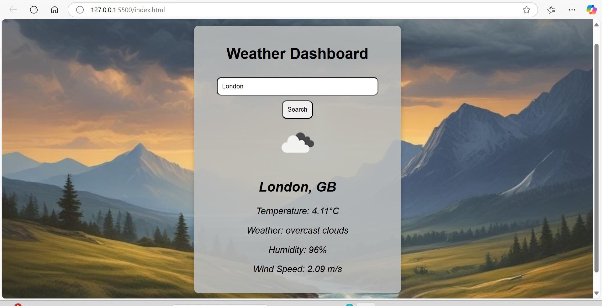

# Weather Dashboard 🌤️

A beautiful and simple **Weather Dashboard** built using **JavaScript**, **HTML**, and **CSS**. This project fetches weather data for any city using the **OpenWeatherMap API** and displays dynamic **weather icons** based on the current weather conditions (sunny, cloudy, rainy, etc.). 🌦️

## Features ✨

- **Real-time weather data**: Fetch weather data for any city using the OpenWeatherMap API. 🌍
- **Weather icons**: Display weather icons dynamically based on the current weather (e.g., sunny 🌞, rainy 🌧️, cloudy ☁️).
- **Responsive design**: The dashboard is mobile-friendly and adjusts to different screen sizes 📱.

## Tech Stack ⚙️

- **HTML**: Structure of the page and content.
- **CSS**: Styling of the dashboard with a responsive layout.
- **JavaScript**: Logic for fetching weather data and dynamically displaying weather icons.
- **OpenWeatherMap API**: API used for retrieving weather data.

## How to Use 🚀

1. Clone the repository:
   ```bash
   git clone https://github.com/your-username/weather-dashboard.git
   ```

2. Navigate into the project folder:
   ```bash
   cd weather-dashboard
   ```

3. Open the `index.html` file in your browser to view the Weather Dashboard. 🌐

4. Enter the name of a city in the search bar to fetch the current weather and display the corresponding weather icon. 🌈

## Features & Screenshots 📸

### Current Weather
- Displays the city name, temperature, weather description, humidity, wind speed and an icon representing the weather condition. 🌞🌧️

### Weather Icons
- Dynamically loads and displays an appropriate weather icon based on the current weather (e.g., sun for sunny weather 🌞, cloud for cloudy weather ☁️, and raindrop for rainy weather 🌧️).



## API Key 🔑

To use the OpenWeatherMap API, you'll need to get your **API key**:

1. Go to [OpenWeatherMap](https://openweathermap.org/).
2. Sign up for an account and generate your free API key.
3. Replace the `apiKey` variable in `script.js` with your API key.

```js
const apiKey = "your-api-key-here";
```

## Installation 🛠️

1. Clone the repository to your local machine.
2. Open the `index.html` file in a web browser.
3. The Weather Dashboard will now display weather information and corresponding icons for your searched city. 🌟

## Future Improvements 🔮

- Add additional features like **forecast** and **location-based weather**. 📅
- Improve **error handling** for city searches and invalid inputs. ⚠️

## Contributing 🤝

Feel free to open issues and submit pull requests if you'd like to contribute improvements or bug fixes! 🎉

1. Fork the repository.
2. Create a new branch (`git checkout -b feature-branch`).
3. Commit your changes (`git commit -am 'Add new feature'`).
4. Push to the branch (`git push origin feature-branch`).
5. Open a pull request.

## License 📝

This project is licensed under the MIT License – see the [LICENSE](LICENSE) file for details.
